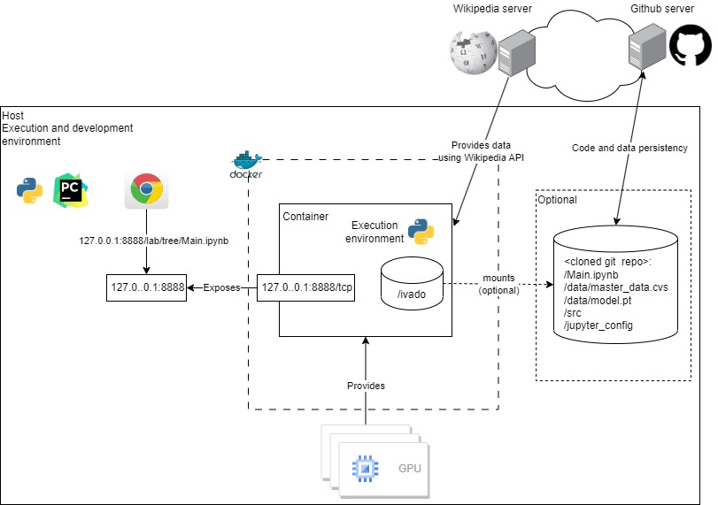

# IVADO LABS Assignment

# Requirements

## Description
A new world organization has just been created. It includes all the museum management committees that have more than 2,000,000 visitors annually. This list is available via __[Wikipedia](https://en.wikipedia.org/wiki/List_of_most_visited_museums)__
This new organization wishes to correlate the tourist attendance at their museums with the population of the respective cities. To achieve this, a small, common and harmonized database must be built to be able to extract features. This DB must include the characteristics of museums as well as the population of the cities in which they are located. You have been chosen to build this database. In addition, you are asked to create a small linear regression ML algorithm to correlate the city population and the influx of visitors.  Your solution must balance the need for quickly assessing the data, rapid prototyping and deploying a MVP to a (potentially) public user that could later scale. You must use the Wikipedia APIs to retrieve this list of museums and their characteristics. You are free to choose the source of your choice for the population of the cities concerned.

## Deliverables
- It is required that your code is a structured Python project. The code should be packaged and exposed in a Docker container (use Docker Compose if you require additional infrastructure).
- A jupyter notebook hosted in docker should also be created. This notebook should  programmatically use your other code to visually present the results of your regression model.

## Notes
You will be evaluated not only on how your code works but also on the rationale for the choices you make. you make.

# Solution

## General idea
As per requirements a small library is developed. The library allows to gather and prepare the required data for further 
analysis. The analysis consists in training an ML model to perform a linear regression allowing to predict the museum 
visits based on the size of the city the museum is located in. The execution environment (Python3.10.x, along with 
all the necessary libraries and notebooks) are packaged in a Docker image, this image mounts a folder (local or remote) 
that clones this GitHub repository and contains the library along with the Jupyter notebook. GitHub is used to persist 
and share the Jupyter notebook, the master data and the trained model. The Docker image may be executed without mounting any 
external folders. In that configuration the image creates an entirely self-contained container. Namely, the original 
input data set along with the trained model are stored in the image while any changes in the data are be persisted only 
while the corresponding container is not removed from the system (i.e. using __docker rm__ command).

### Why this approach?
The nature of the data allows to assume a relatively small set with very limited evolution potential. This enables us 
to store the entire data set in the Docker image.
Similarly, the linear regression requirement needs a very small amount of parameters hence also allowing to be embedded 
into the Docker image. 
Additionally, at the time of the implementation I'm facing the following unknowns:
- Detailed customer workflow: How this implementation will be used, by how many people, part of what bigger scheme?
- Detailed customer deployment: K8s vs just a Docker/DockerCompose on physical or virtual host, if any, which public cloud 
provider AWS, GCP, Azure would be considered? Who's infrastructure (customer or ours) would be considered etc. etc.?
Therefore, the chosen approach provides the most flexibility and the least constraints in terms of customer side requirements. 
It may be adjusted easily to fit into any set of additional constraints.  

## High level deployment layout
The figure below depicts the deployment layout.



### Host
Has the following purposes:
- **Development platform**: While developing the solution a Linux Ubuntu-22.04 (WSL) is used as the development platform. 
It hosts the IDE along with all the necessary environment, tools and libraries for image creation, easy execution and testing  
- **Execution platform**: for the target image, providing GPU hardware, Docker server, Docker registry (unless a registry service is used),
file server for content peristency.
  
### Wikipedia server
Acts as the data source, data is retrieved using the [Wikipedia API](https://www.mediawiki.org/wiki/API:Main_page) 

### GitHub server
Used for project code and data persistency and sharing.

### Docker
Provides the execution environment, namely the container based on Ubuntu-22.04 contains all the required Python end Nvidia components necessary for executing the target image.
The target image:
- Exposes the TCP port 8888
- Provides access to the GPU hardware
- Optionally mounts the host file system for persistency, Docker image internal __/run__ folder to __<cloned directory>__


## Repository content
|    File/folder    |   Type    | Description                                          |                                          
|:-----------------:|:---------:|:-----------------------------------------------------|
|    Main.ipynb     |   File    | Jupyter notebook allowing access to the api          |
|  docker_build.sh  |   File    | Script wrapping the Docker image creation            |
|  docker_setup.sh  |   File    | Script that creates the conteeng of the Docker image |
|  docker_start.sh  |   File    | Script wrapping the docker container startup         |
|    Dockerfile     |   File    | Docker image description file                        | 
| requirements.txtt |   File    | Python dependencies requirements                     |
|     start.sh      |   File    | Jupyter notebook startup script, command line for development purpose or Docker image entry point | 
|      test.sh      |   File    | Scrpt launching the unit tests |
|       data        | Directory | Contains the saved master data and regression model |
|        src        | Directory | Contains the main library source code |
|       test        | Directory | Contains the main library test scripts| 
|       docs        | Directory | Contains additional documentation files |

## Limitations of the demonstration system
This is a demo/assignment application, because of time constrainte it contains the following constraints:
- The security considerations have been omitted: It is possible to inject malicious values through the API.
- Model persistency is achieved using Python **pickle** library which is not secure.
- The system has neither been designed nor tested for all the possible corner cases.
- The unit test set only contains several test cases.
- Comments are minimal.
- Only the Ubuntu-22.04 on Windows 11 WSL2 with Nvidia GPU support configuration has been tested, other configuration 
will require deployment adjustments.
- The current implementation and procedure allows only for a simple single user peristance and sharing, the presented 
scheme would need to be enhanced to allow contributions from multiple team members.
- Inefficient Docker image, the current image is 'naively' built from scratch on top of an Ubuntu-22.04 image. This 
process should be refined by: selecting a potentially slimmer base image and/or use layers to avoid rebuilding the 
while image because of missing trivial dependencies.

## Source code structure
- __src/museums.py__: Main api module that allows to access all the feature of the application
- __src/components/data.py__: Implementation of the data extraction and basic data preparation functionalities including the persistancy
- __src/components/model.py__: Implementation of the linear regression model

## Prerequisites
- Intel 64bit platform
- Windows 11
- Ubuntu-22.04 in the Windows 11 WSL2 environment the setup procedure may be found [here](https://ubuntu.com/tutorials/install-ubuntu-on-wsl2-on-windows-11-with-gui-support#1-overview)
- Docker service
- Python 3.10.x (development only)
- Pip 22.x.y (development only)
- Optional Nvidia GPU graphic card (used for this assignment: NVIDIA GeForce GTX 1660 Ti)
- Optional Nvidia prerequisites, setup procedure may be found [here](https://developer.nvidia.com/cuda-downloads) 
- Optional Nvidia docker support procedure may be found [here](https://docs.nvidia.com/datacenter/cloud-native/container-toolkit/latest/install-guide.html)

## Workflows
### Launch
- Clone the [repository](https://github.com/bartbalaz/ivado_labs_assignment) to __assignment__ folder
```commandline
git clone git@github.com:bartbalaz/ivado_labs_assignment.git assignemnt
```
- Switch to the cloned repository
```commandline
cd assignment
```
- Optionl: Run the unit tests
```commandline
./test.sh
```
- Optional: Start Jupyter notebook locally, Note you have to stop the Jupyter notebook before starting the Docker image below
```commandline
./start.sh
```
- Build the Docker image
```commandline
./docker_build.sh
```
- Start the docker image
```commandline
./docker_start.sh
```
- Or start the image in isolation (i.e. __self-contained__ mode)
```commandline
./docker_start.sh --isolation
```
- Once done working (finished **Experimentation**), stop the docker image by issuing __'Ctrl+C'__, then __'y'__, in 
the console.
- If not started in self-contained mode work may be persisted and shared with others by pushing the changes to the 
GitHub repository (see limitations above).
```commandline
git add .
git commit -m "<some comment>"
git push orign main
```

### Experimentation in the browser Jupyter notebook
- Using a browser go to [http://localhost:8888/lab/tree/Main.ipynb](http://localhost:8888/lab/tree/Main.ipynb)
- Import the API module
```python
import importlib
import museums
# This is required for development purpose to ensure that the library is reloaded by Jupyter when the code cell is run
importlib.reload(museums)    
```
- Download the data from Wikipedia [Museums page](https://en.wikipedia.org/wiki/List_of_most_visited_museums) and 
[Cities page](https://en.wikipedia.org/wiki/List_of_largest_cities). Optionally you may want to print the downloaded data.
```python
museums.download_data()
museums.print_museum_data()
museums.print_city_data()
```
- Create master that will serve as the model input, some data customization is specified in the museums module for: 1. Missing populations 
(**custom_locations**) and 2. Locations naming adjustments (**custom_population**). The custom location and population may adjusted by modifying the
**museums.location_overrides** and **museums.missing_city_populations** member variables (viewed using 
**museums.print_missing_city_populations()** and **museums.print_location_overrides()** methods).
```python
museums.create_master_data(custom_locations = True, custom_population = True)
```
- Verify master data, this steps generates a table that shows all the missing cells. 
```python
museums.verify_master_data()
museums.print_master_data_issues()
```
- Once satisfied with the data, the data may be saved and later loaded.
```python
museums.save_master_data() # For saving
musemms.load_master_data() # For loading
```
- When the master data is ready the model trainng may take place, create and train model. The parameters are
**lr**: learning rate, **threshold**: minimum museum visits to be part of the training set, **epochs**: The number of 
training iterations, **test_ratio**: The percentage proportion of the datapoints to be used as the data set
```python
museums.create_model(lr = 0.001)
museums.train_model(threshold=2000000, epochs: int = 20000, test_ratio=20)
```
- Once the training has been done it may be saved and loaded
```python
museums.save_model() # For saving
museums.load_model() # For loading
```
- The training run details may be printed or plotted
```python
museums.print_training()  # For printing
museums.plot_training() # For plotting
```
- The model may be used to evaluate values
```python
museums.evaluate([<integer value of the city population>, <...>])
```